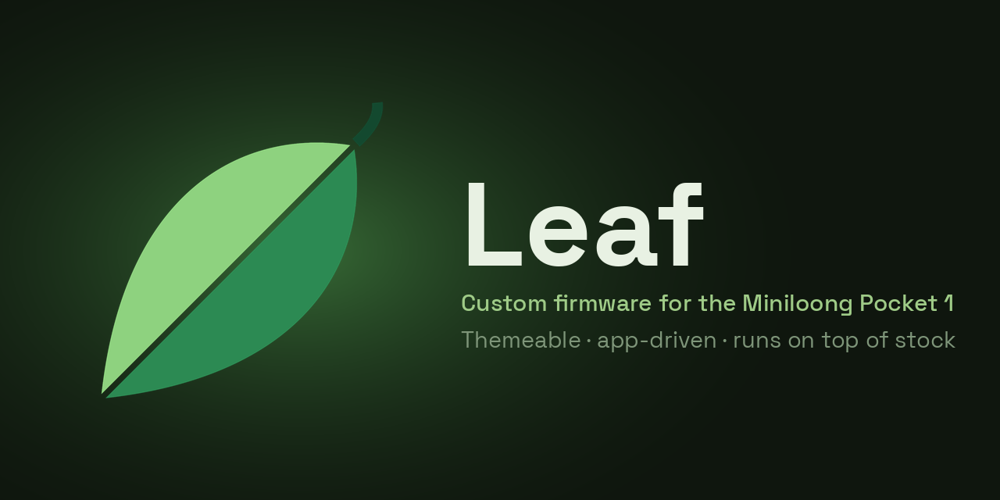

<p align="center">
  
</p>

<p align="center">
  <a href="https://github.com/Utility-Muffin-Research-Kitchen/Leaf/releases"></a>
  <a href="https://github.com/Utility-Muffin-Research-Kitchen/Leaf/releases"></a>
  <a href="LICENSE"></a>
  
</p>

Leaf is the developer command surface for the UMRK launcher workspace. It owns
workspace bootstrap, cross-repo status/preflight, payload assembly, and SD-card
deployment. Product repos remain independent siblings and keep their own build
and package targets.

## Setup

Create a parent workspace, clone Leaf, then let Leaf clone the public sibling
repos. If your GitHub account has access to the private internal planning repo,
bootstrap will clone it too; otherwise it is silently skipped.

```sh
mkdir -p ~/dev/UMRK
cd ~/dev/UMRK
git clone https://github.com/Utility-Muffin-Research-Kitchen/Leaf.git
cd Leaf

make bootstrap
make -C ../mlp1-toolchain image
make doctor
make stage DEVICE=mlp1
```

By default Leaf treats its parent directory as the workspace root:

```text
~/dev/UMRK/
  Leaf/
  Catastrophe/
  Jawaka/
  Thing-File/
  ssh-server/
  CentralScrutinizer/
  Fugazi/
  PPSSPP-spruce/
  steward-fu-nds/
  N64-standalone/
  Flycast-standalone/
  retroarch-builds/
  Cores-spruce/
  mlp1-toolchain/
  miniloong-launcher-switcher/
  miniloong-adb-keeper/
  umrk-workspace/      # optional internal docs/plans, only with access
```

For unusual checkout layouts, set `LEAF_WORKSPACE_DIR`:

```sh
LEAF_WORKSPACE_DIR=/Volumes/Storage/UMRK make status
```

## Commands

Run commands from the `Leaf` repo:

```sh
make bootstrap                              # clone public repos; privately clone internal docs when accessible
make doctor                                 # preflight: adb / docker / toolchain / device
make status                                 # git status across public siblings
make status-internal                        # git status including private maintainer repos

make stage DEVICE=mlp1                      # full: launcher payload + all apps
make stage-refresh DEVICE=mlp1              # full stage, then restart Jawaka GUI
make refresh-jawaka DEVICE=mlp1             # restart Jawaka/Loong GUI stack only
make stage-jawaka DEVICE=mlp1               # launcher payload only
make stage-retroarch DEVICE=mlp1            # RetroArch binary + cores + info + shaders
make stage-emulator EMULATOR=drastic DEVICE=mlp1
make stage-emulator EMULATOR=mupen64plus DEVICE=mlp1
make stage-emulator EMULATOR=flycast DEVICE=mlp1
make stage-emulators DEVICE=mlp1            # PPSSPP + DraStic + N64 + Dreamcast
make stage-app APP=ssh-server DEVICE=mlp1   # stage one app
make stage-app APP=Thing-File DEVICE=mlp1
make stage-app APP=CentralScrutinizer DEVICE=mlp1
make stage-app APP=Fugazi DEVICE=mlp1
make stage-app APP=Leaf-Itchio-Pak DEVICE=mlp1  # optional developer/acceptance stage only
make stage-app APP=DiscoBoy DEVICE=mlp1         # optional developer/acceptance stage only
make stage-app APP=VideoFromHell DEVICE=mlp1    # optional developer/acceptance stage only
make stage-app APP=Nimbus DEVICE=mlp1           # optional developer/acceptance stage only
make stage-app APP=PortMaster-mlp1 DEVICE=mlp1  # optional developer/acceptance stage only

make release-zips DEVICE=mlp1               # build end-user install + recovery ZIPs
make release-sd-zip DEVICE=mlp1             # build end-user install ZIP only
make release-recovery-zip DEVICE=mlp1       # build end-user recovery ZIP only
```

On MLP1, `stage-app` uses Jawaka's `package-quiesce-v1` barrier before it
removes or pushes any package bytes. Close foreground apps first. A missing
daemon, stale/unverified service generation, or rejected barrier fails the
stage without modifying the destination. After a successful push (and also on
a failed push), the helper asks Jawaka to rescan manifests and restore only
persistent Start-with-Leaf intent. `make package-quiesce-smoke` covers the
ordering and failure cleanup with a fake ADB endpoint.

The five first-party optional apps above are registered only for an explicit
developer stage. They remain Pak Rat-owned and are excluded from default full
staging, release ZIPs, `managed_apps`, and bootstrap requirements. Store
install/update/uninstall testing must still use Pak Rat rather than `stage-app`.

For a local Pak Rat catalog, pass one or more app repositories containing
`pakrat.json`. The generator builds each selected package and writes only below
`build/pakrat-local`:

```sh
python3 scripts/pakrat-local-feed.py \
  --app-dir ../Leaf-Itchio-Pak \
  --app-dir ../PortMaster-mlp1
```

To exercise the exact ZIP downloaded from a draft release without repackaging
it, add an app-id-to-file override:

```sh
python3 scripts/pakrat-local-feed.py \
  --app-dir ../Leaf-Itchio-Pak \
  --skip-build \
  --artifact org.umrk.itchio=/path/to/Itch-io.mlp1.pak.zip
```

The exact-artifact path is copied byte-for-byte into the local feed. Pak Rat
lifecycle testing still uses the generated catalog and Jawaka ownership state.

`make bootstrap` is idempotent. Existing sibling repos are reported as present
and left untouched. Missing public repos are cloned into `Leaf/..`; optional
private repos are cloned only when credentials are available.

## End-User SD Install Package

Leaf can build root-extractable ZIPs for installing Leaf on a Miniloong Pocket
1 without requiring ADB first. This is the preferred path for making a device
installation package for end users.

From the `Leaf` repo:

```sh
make bootstrap
make -C ../mlp1-toolchain image
make release-zips DEVICE=mlp1
```

The release command builds missing MLP1 components, assembles the launcher and
platform payload, packages standalone emulators including N64 and first-party apps, and asks
`miniloong-launcher-switcher` to generate the stock `loong_upgrade` install and
recovery payloads.

Output is written to:

```text
build/release/leaf-mlp1-sd-<release_id>.zip
build/release/leaf-mlp1-recovery-<release_id>.zip
```

`<release_id>` defaults to the current date plus the Leaf git short SHA for
untagged local/development builds. To choose it explicitly:

```sh
make release-zips DEVICE=mlp1 RELEASE_ID=2026-06-05-test1
```

Published builds use the Git tag as their exact release ID. Stable builds
require an explicit semantic version and matching tag:

```sh
make release-zips DEVICE=mlp1 \
  RELEASE_ID=v0.7.0 \
  LEAF_RELEASE_CHANNEL=stable \
  LEAF_RELEASE_VERSION=0.7.0 \
  LEAF_RELEASE_TAG=v0.7.0
```

Both channels have a guarded one-input target. Prefer these over setting the four
values by hand:

```sh
make stable-zips TAG=v0.9.0 DEVICE=mlp1
make beta-zips   TAG=v0.9.0-beta.1 DEVICE=mlp1
```

`stable-zips` accepts only a bare `vX.Y.Z` and publishes to the main Leaf
repository; `beta-zips` accepts only `vX.Y.Z-beta.N` and publishes to `Leaf-beta`.
Each derives the complete identity from the tag and verifies the built artifact
afterwards.

Both build the install and recovery ZIPs and verify the embedded provenance plus
`leaf-update.json`. Release-candidate tags
are a separate main-repository/local-manifest rehearsal lane and are
intentionally not accepted by `beta-zips`.

A tagged build carries four related values:

| Value | Role |
| --- | --- |
| `RELEASE_ID` | Exact artifact name, on-card release directory, and OTA equality identity. |
| `LEAF_RELEASE_VERSION` | Installed Device Info label and semantic Pak Rat compatibility identity. Prerelease suffixes remain visible; compatibility compares the `MAJOR.MINOR.PATCH` core. |
| `LEAF_RELEASE_CHANNEL` | Build/publication policy and default release-notes repository. The device's own update-channel setting chooses which feed it checks. |
| `LEAF_RELEASE_TAG` | GitHub publication reference recorded in provenance. |

All tagged install builds fail before packaging if Leaf, the launcher, the
launcher switcher, Catastrophe, or a bundled app has uncommitted changes.
Tagged builds also require `RELEASE_ID` to match `LEAF_RELEASE_TAG`. Exact
component commits are recorded inside the release at
`provenance/components.json`. Unqualified local builds use the `dev` channel
and may fall back to `RELEASE_ID` for version. `LEAF_RELEASE_REPOSITORY` can
override the default host when calling `release-zips` directly; `beta-zips`
pins it to `Leaf-beta`.

The install ZIP is extracted directly to the SD-card root. It must not be
placed inside another folder. The SD card should be FAT32 or ext4; do not use
exFAT because the MLP1 stock update path ignores exFAT media.

End-user flow:

1. Extract `leaf-mlp1-sd-<release_id>.zip` to the SD-card root.
2. Boot the MLP1 with the SD card inserted.
3. Wait on the stock update screen while the installer runs. The progress
   indicator may sit at 50 percent while files are copying.
4. Wait for the device to reboot by itself.
5. Boot normally with the SD card inserted; Leaf should start automatically.

The install package does not silently enable or pin ADB. ADB can be enabled
later from Leaf/Jawaka settings.

To return a device to stock boot without ADB, extract
`leaf-mlp1-recovery-<release_id>.zip` to the SD-card root and boot the device
once with that card inserted. Wait for the device to reboot by itself.
Recovery removes the Leaf hook/session and leaves SD-card user content intact.

## Ownership

Leaf owns deployment and orchestration:

- Bootstrap and repo discovery.
- Cross-repo status.
- Environment and device preflight.
- Launcher payload assembly.
- SD-card path resolution.
- ADB staging.
- Activation marker control.
- Launcher restart and log-tail helpers.
- End-user SD install/recovery ZIP generation.

Sibling repos own their build/package outputs:

- `Jawaka` builds launcher binaries.
- `Catastrophe` builds shared assets.
- `retroarch-builds` builds/packages RetroArch.
- `Cores-spruce` builds libretro cores and info files.
- App repos package their `.pak` directories.
- `mlp1-toolchain` owns the cross-compile Docker image.

The runtime stock-firmware switcher mechanism remains in
`miniloong-launcher-switcher`.

## SD Layout

Leaf stages launcher-owned internals under one hidden SD root:

```text
$SDCARD_PATH/.system/leaf/platforms/mlp1/enabled
$SDCARD_PATH/.system/leaf/platforms/mlp1/launcher/env.sh
$SDCARD_PATH/.system/leaf/platforms/mlp1/launcher/bin/...
$SDCARD_PATH/.system/leaf/platforms/mlp1/bin/
$SDCARD_PATH/.system/leaf/platforms/mlp1/cores/
$SDCARD_PATH/.system/leaf/platforms/mlp1/shaders/ # validated release source
$SDCARD_PATH/.system/leaf/platforms/mlp1/emulators/
$SDCARD_PATH/.umrk/mlp1/                       # launcher control state (library.db, wifi.conf, ...)
$SDCARD_PATH/.umrk/mlp1/retroarch/.config/retroarch/shaders/
                                                # durable Leaf/updater/custom shader browser root
$SDCARD_PATH/.umrk/mlp1/adb-enabled
$SDCARD_PATH/.userdata/mlp1/logs/              # durable user/app data + logs
$SDCARD_PATH/.userdata/shared/
```

Everything under `.system/leaf/platforms/mlp1` is release-managed (replaced on
install/update). Durable state lives at the SD root under `.umrk/` and
`.userdata/`, so a manual upgrade never overwrites it.

`state/adb-enabled` is Jawaka's durable request for the Leaf init hook to
restore the stock ADB pin at boot. The launcher activation marker is separate:
`platforms/mlp1/enabled`.

User-facing content folders remain at the SD root:

```text
Roms/
Images/
Apps/
  mlp1/<Name>.pak/
  shared/<Name>.pak/
BIOS/
Saves/
States/
Cheats/
```

`Apps/` is a namespace root. Leaf stages native apps under `Apps/<platform>/`
and wrapper/runtime-delegating apps under `Apps/shared/`; flat
`Apps/<Name>.pak/` entries are not part of the Jawaka discovery contract.

`Roms/` and `Images/` use one canonical public folder per console — one folder
per system, not one per emulator. Legacy alias folders (e.g. `Roms/FC` for NES)
still scan and fold into the canonical system; emulator variants are a launcher
**Core** choice, not a separate folder. The canonical folder per system plus its
accepted aliases come from the staged platform `systems.json`, driven by
`umrk-workspace/scripts/system_folder_policy.json`; the release path enforces the
invariant via `retroarch_validate_package.py --canonical-systems`.

The current first-party app policies are:

```text
ssh-server        -> Apps/mlp1/SSHServer.pak/
Thing-File        -> Apps/mlp1/Thing-File.pak/
CentralScrutinizer -> Apps/mlp1/CentralScrutinizer.pak/
Fugazi            -> Apps/mlp1/Fugazi.pak/
retroarch-builds  -> Apps/shared/RetroArch.pak/
```

Standalone game emulator payloads are staged under
`.system/leaf/platforms/mlp1/emulators/`. PPSSPP is built from the UMRK
`PPSSPP-spruce` sibling repo. Mupen64Plus standalone is built from the
`N64-standalone` sibling repo and launched as a selectable path core for the
canonical `Roms/N64` library. Flycast standalone is built from the
`Flycast-standalone` sibling repo and initially offered as a selectable
alternate for the canonical `Roms/DC` library; RetroArch Flycast remains the
default during compatibility soak. DraStic is packaged from the local
`steward-fu-nds` sibling repo: Leaf bundles the cross-built steward SDL2 custom
menu stack with the prebuilt `drastic64` binary, keeps runtime state under
`state/drastic/`, and runs it through `SDL_VIDEODRIVER=NDS`. Single-emulator ADB
staging also refreshes the platform defaults that Jawaka scans for packaged
standalone launch targets. DraStic's in-game menu is handled by the steward
custom menu, with Jawaka passing the MLP1 Menu button through to the emulator.

This is a hard cutover from the old `umrk-launcher`, `UMRK`, `.umrk`,
`.userdata`, and `.umrk-launcher` layout. Leaf does not migrate or delete old
folders automatically.
